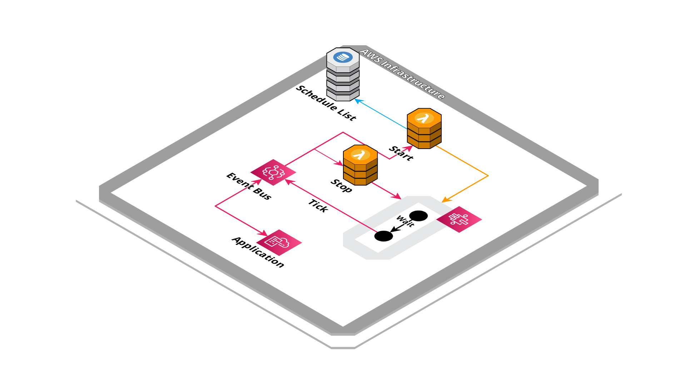

# Serverless Dynamic Scheduler


Implementation of scheduler system able to send event in a future date.

## Created resources

A set of Lambda function connected to EventBridge rules that handle start, stop and task start. Create StepFunction state machine to wait until a specific date and send events.



## Installation

Using the [SAM CLI](https://docs.aws.amazon.com/serverless-application-model/latest/developerguide/what-is-sam.html):
```bash
sam build
sam deploy --guided
```

## Parameters

This application need some parameters when you deploy it:

- **EventBusName**: The event bus name to connect the integration to.

## Usage

Send and receive events from and to the configured event bus (from `EventBusName` parameter).

All events received and sent require the "id" attribute to identity the correct scheduling configurations.   

### Start scheduling

With cron expression:
```json
{
  "Source": "test",
  "DetailType": "Schedule Start",
  "Detail": {
    "id": "test:schedule", 
    "cron": "30 * * * *"
  }
}
```

Limiting iterations:
```json
{
  "Source": "test",
  "DetailType": "Schedule Start",
  "Detail": {
    "id": "test:schedule", 
    "cron": "30 * * * *",
    "limit": 10
  }
}
```

### Send a single event into the future

This schedule event will be sent once base on "duration" property:
```json
{
  "Source": "test",
  "DetailType": "Schedule Start",
  "Detail": {
    "id": "test:duration-5m", 
    "duration": "5m"
  }
}
```
```json
{
  "Source": "test",
  "DetailType": "Schedule Start",
  "Detail": {
    "id": "test:duration-1h", 
    "duration": "1h"
  }
}
```

## Listen for "tick" event

This event will be send when the scheduling time has been reached:
```json
{
  "Source": "com.my-stack-name",
  "DetailType": "Schedule Tick",
  "Detail": {
    "id": "test:schedule"
  }
}
```

## Stop scheduling

```json
{
  "Source": "test",
  "DetailType": "Schedule Stop",
  "Detail": {
    "id": "test:schedule"
  }
}
```

## Credits

- Repository badges by [Shields.io](https://shields.io/)
- Infrastructure schema by [Cloudcraft](https://www.cloudcraft.co/)
